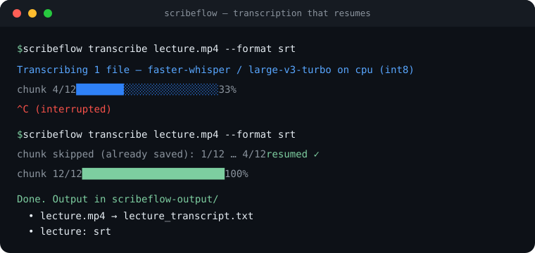

<!--
  Brand logo: docs/images/logo.png (horizontal) + docs/images/icon.png (square app
  icon). demo.svg is a static terminal preview — swap in an animated GIF anytime.
-->

<p align="center">
  
</p>

<p align="center">
  <strong>English</strong> | <a href="README.tr.md">Türkçe</a>
</p>

<p align="center">
  <strong>Turn your audio &amp; video recordings — lectures, interviews, films — into clean
  text transcripts and subtitle files.</strong><br/>
  Runs on your own computer (nothing is uploaded). If a run is interrupted, just run it
  again — it picks up exactly where it left off.
</p>

<p align="center">
  <a href="https://pypi.org/project/scribeflow/"></a>
  <a href="https://pypi.org/project/scribeflow/"></a>
  <a href="LICENSE"></a>
  <a href="https://github.com/htahaozlu/scribeflow/actions"></a>
  <a href="https://pypi.org/project/scribeflow/"></a>
</p>

<p align="center">
  
  
  
</p>

<p align="center"><sub>Powered by OpenAI's Whisper speech-recognition models (faster-whisper · whisper.cpp · openai-whisper).</sub></p>

---

## Get a transcript in 60 seconds

> You need **Python 3.10–3.12** and a terminal (Terminal on macOS, PowerShell on Windows).

```bash
pip install scribeflow
scribeflow transcribe ./lecture.mp4
```

You also need **ffmpeg** once — `brew install ffmpeg` (macOS) or `sudo apt-get install -y ffmpeg`
(Linux). Run `scribeflow doctor` to check your setup.

**What you get:** a transcript at `scribeflow-output/lecture/lecture_transcript.txt`.
Want subtitles too? Add `--format srt`:

```bash
scribeflow transcribe ./lecture.mp4 --format srt
```

If the run stops (crash, closed laptop, lost connection), run the **same command** again — it
resumes from the last finished part, with no duplicated or garbled text.

---

## Why ScribeFlow

It's the same simple pipeline as running Whisper yourself, but it handles the annoying parts:

- 🛟 **Never lose work.** It saves progress chunk-by-chunk and resumes after any interruption —
  the reason it exists.
- 💻 **Runs anywhere.** Your laptop (CPU or NVIDIA GPU), a Mac (Apple Silicon / Metal), or
  **free Google Colab** — it detects the hardware and picks a good model automatically.
- 📥 **Any source.** A file, a whole folder, a URL (e.g. YouTube), or Google Drive.
- 📝 **Subtitles included.** A `.txt` transcript always; `.srt` / `.vtt` / `.json` on request,
  with correct timecodes across the whole recording.
- 🔒 **Private by default.** Everything runs locally with open models — nothing is sent to a
  cloud service.

**Languages.** ScribeFlow handles every language Whisper does. The defaults are tuned for
**Turkish** (`-l tr` by default); pass `-l en` (or any code), or `-l auto` to detect the language.

**Accuracy.** Transcripts are generated automatically by speech recognition — very good, but not
perfect. Plan to proofread names, technical terms, and overlapping speech. It is not a certified,
word-for-word record.

---

## Demo

<p align="center">
  
</p>
<p align="center"><sub><em>Start a transcription, interrupt it, run the same command again — it resumes and finishes.</em></sub></p>
<p align="center"><sub>Static preview · regenerate a live GIF with <a href="scripts/record-demo.sh"><code>scripts/record-demo.sh</code></a> (needs <a href="https://github.com/charmbracelet/vhs">vhs</a>).</sub></p>

---

## Install

The base install is small: the engine plus the default **faster-whisper** backend, which works
on CPU out of the box.

```bash
pip install scribeflow
```

**ffmpeg** is the only system dependency:

```bash
brew install ffmpeg                  # macOS (Homebrew)
sudo apt-get install -y ffmpeg       # Debian / Ubuntu
sudo dnf install -y ffmpeg           # Fedora
winget install Gyan.FFmpeg           # Windows
```

### Run once without installing

ScribeFlow is on PyPI, so the Python equivalents of `npx` work today:

```bash
uvx scribeflow transcribe ./lecture.mp4   # run once, nothing installed (uv)
pipx install scribeflow                   # isolated global install
```

### Optional extras

Add only what you need:

```bash
pip install 'scribeflow[web]'      # browser UI:  scribeflow web
pip install 'scribeflow[url]'      # transcribe straight from a URL (yt-dlp)
pip install 'scribeflow[drive]'    # Google Drive source
```

<details>
<summary>Advanced backends (most people don't need these)</summary>

```bash
pip install 'scribeflow[gpu]'      # torch + CUDA notes (you pick the wheel for your driver)
pip install 'scribeflow[cpp]'      # whisper.cpp / pywhispercpp — Apple-Silicon Metal GPU path
pip install 'scribeflow[openai]'   # openai-whisper (the PyTorch reference implementation)
```

</details>

<details>
<summary>From a clone (for development)</summary>

```bash
git clone https://github.com/htahaozlu/scribeflow
cd scribeflow
pip install -e '.[dev]'
```

</details>

> **Homebrew tap:** coming soon. PyPI is already live, so use `pip` / `pipx` / `uvx` above for now.

---

## Usage

```bash
scribeflow transcribe <source> [options]
scribeflow models       # list models + show the best pick for your computer
scribeflow doctor       # check ffmpeg / device / backends
scribeflow gen-notebook <source> -o nb.ipynb   # make a ready-to-run Colab notebook
scribeflow web          # browser UI ([web] extra)
scribeflow --version
```

The `<source>` can be a local file/folder, a `http(s)://` URL, or a `drive:` path — the kind is
auto-detected.

**Flags you'll usually use:**

| Flag | What it does |
| ---- | ------------ |
| `--format txt,srt,vtt,json` | Extra outputs (comma-separated). `txt` is always written. |
| `--language` / `-l` | Spoken language: `tr` (default), any code, or `auto` to detect. |
| `--out DIR` | Where transcripts are saved (default `scribeflow-output/`). |
| `--overwrite` | Ignore a previous run and start fresh. |

<details>
<summary>Advanced flags (most people can ignore these)</summary>

| Flag | What it does |
| ---- | ------------ |
| `--backend` | `faster-whisper` · `whispercpp` · `openai-whisper` (auto-picked otherwise). |
| `--model` | Force a model (default `large-v3-turbo`). |
| `--device` / `--compute-type` | e.g. `cuda` / `float16`, `cpu` / `int8`. |
| `--want speed\|quality\|default` | Bias the automatic model pick. |
| `--chunk-minutes` | Length of each resumable chunk (default 20). |
| `--beam-size` | Decoder beam width (default 5). |
| `--workspace DIR` | Scratch dir for heavy audio I/O (kept off Drive on Colab). |
| `--cache-dir DIR` | Where models are downloaded. |
| `--runtime auto\|local\|colab` | Execution target. |
| `--source-kind local\|url\|drive\|upload` | Override source auto-detection. |
| `--config FILE` | Path to a `scribeflow.toml`. |
| `--json` | Machine-readable output. |
| `--ui-lang` / `--lang en\|tr` | Interface language (separate from `--language`). |

</details>

**Examples:**

```bash
# A whole folder, with subtitles
scribeflow transcribe ./lectures/ --format srt,vtt

# An English talk from a URL (needs the [url] extra)
scribeflow transcribe "https://example.com/talk.mp4" -l en

# A file from Google Drive on Colab (needs the [drive] extra)
scribeflow transcribe "drive:My Drive/interviews/session1.mp4"
```

---

## Output formats

The `.txt` transcript is **always** written. Add others with `--format`:

| `--format` | You get | Use it for |
| ---------- | ------- | ---------- |
| `txt` | Plain transcript | Reading, search, notes (always produced). |
| `srt` | Subtitles with timecodes | Most video players, YouTube. **Not sure? Use this.** |
| `vtt` | Web subtitles | HTML5 `<video>` on the web. |
| `json` | Segments with timing | Feeding other tools. |

Subtitle timecodes are correct across the whole recording, not just within each chunk.

---

## Runs anywhere — pick what fits

ScribeFlow detects your hardware and chooses a sensible model automatically (`scribeflow models`
shows the pick). **You normally don't need to configure anything below** — it's only for
overriding the defaults.

<details>
<summary>Backends &amp; hardware (advanced)</summary>

Every backend produces the same output shape, so you can swap them freely.

| Backend | Best for | Install |
| ------- | -------- | ------- |
| `faster-whisper` | CPU and NVIDIA GPU (the default) | base install |
| `whispercpp` | Apple Silicon (Metal GPU) | `pip install 'scribeflow[cpp]'` |
| `openai-whisper` | PyTorch reference baseline | `pip install 'scribeflow[openai]'` |

Auto-select rules:

- **Apple Silicon** → whisper.cpp on Metal when its binary is available, otherwise faster-whisper
  on CPU. faster-whisper has no CUDA/MPS on macOS, so ScribeFlow won't offer that combination.
- **NVIDIA GPU** → `float16` (≥ 8 GB VRAM) or `int8_float16`.
- **CPU** → `int8`.
- The global default model is `large-v3-turbo`; low-quality / English-only models are never
  auto-selected for Turkish.

To enable the Apple-Silicon Metal path, point ScribeFlow at a whisper.cpp binary + ggml models:

```bash
export SCRIBEFLOW_WHISPERCPP_BIN=/path/to/whisper-cli
export SCRIBEFLOW_WHISPERCPP_MODELS=/path/to/ggml-models
```

</details>

---

## How resume works

Resume isn't an add-on — it's how the engine runs. The recording is split into chunks; each
finished chunk is saved to disk immediately. **Kill the process and re-run the same command** →
ScribeFlow continues from the last finished chunk. No duplicated work, no corrupted output.

Switching the model/backend mid-run is refused (so outputs never get mixed) — pass `--overwrite`
to start fresh with new settings.

<details>
<summary>Under the hood (for the curious)</summary>

- **Atomic writes.** Each chunk's transcript + a `progress.json` are written with a
  temp-then-rename, so a reader never sees a half-written file and a crash mid-write leaves the
  previous good version intact.
- **RunIdentity guard.** A resume that doesn't match the original backend / model / chunking /
  options raises `CheckpointIdentityError` instead of silently mixing results.
- **Deterministic decoding.** Turkish defaults (`temperature=0.0`, `condition_on_previous_text=False`
  with a tail-prompt hint, `vad_filter=True`, `beam_size=5`) make re-running a chunk reproduce the
  same text, which is what makes resuming safe.

</details>

---

## Free GPU on Google Colab

No fast computer? Generate a notebook and run ScribeFlow free in your browser:

```bash
scribeflow gen-notebook ./lecture.mp4 -o scribeflow_colab.ipynb
```

Open it in [Colab](https://colab.research.google.com/) and run the cells top to bottom — it mounts
Drive, installs ScribeFlow, transcribes, and resumes. URL and Drive sources auto-wire the right
extra.

<details>
<summary>Why it survives a dropped Drive connection</summary>

Colab's Google Drive mount can drop mid-write (`OSError: [Errno 107] Transport endpoint is not
connected`). ScribeFlow keeps heavy, churny I/O (audio chunks, temp files) on local `/content`
scratch and writes only small, durable transcripts + checkpoints to Drive. If the mount blips, your
committed transcripts are already safe and the run resumes.

</details>

---

## Configuration

Settings resolve from **CLI flags → `scribeflow.toml` → environment variables → defaults**. Full
reference: **[docs/CONFIG.md](docs/CONFIG.md)**.

```toml
# scribeflow.toml — pin your defaults
[backend]
model = "large-v3-turbo"
[transcribe]
language = "tr"
[output]
formats = ["txt", "srt"]
```

| Environment variable | Purpose |
| -------------------- | ------- |
| `SCRIBEFLOW_LANG` | Default interface language (`en` / `tr`). |
| `SCRIBEFLOW_WHISPERCPP_BIN` / `..._MODELS` | whisper.cpp binary + ggml models (Apple Silicon). |
| `NO_COLOR` | Disable colored output (also auto-off when piped). |

---

## Limitations

- **Transcription only** — no translation and no speaker labels (diarization).
- **Segment-level timestamps** (per phrase), not word-level.
- **Local models only** — no cloud transcription APIs in v1.
- **Inputs:** anything `ffmpeg` can decode (common audio/video formats).
- Quality matches the underlying Whisper model; proofread the result for important use.

---

## Contributing

Contributions welcome — see **[CONTRIBUTING.md](CONTRIBUTING.md)**.

```bash
pip install -e '.[dev]'
pytest && ruff check . && mypy
```

## License

[Apache-2.0](LICENSE).
