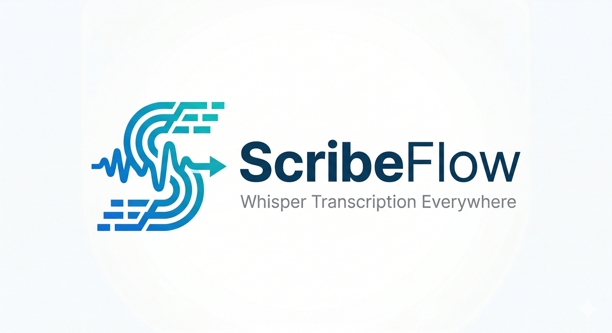
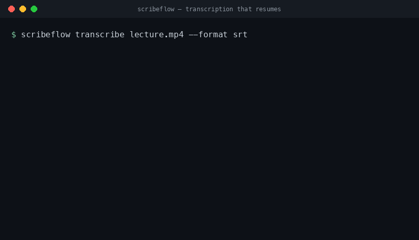

<p align="center">
  <!-- Görseller docs/images/ altında yer alır; sahibinin sağlayacağı varlıklar — eklenene kadar yer tutucudur. -->
  
</p>

<h1 align="center">ScribeFlow</h1>

<p align="center"><em>Taşınabilir, kaldığı yerden devam edebilen, çok arka uçlu Whisper deşifresi — her yerde çalışır, çökmeden sonra kaldığı yerden sürdürür.</em></p>

<p align="center">
  <a href="https://pypi.org/project/scribeflow/"></a>
  
  <a href="LICENSE"></a>
  <a href="https://github.com/htahaozlu/scribeflow/actions"></a>
  <a href="https://pypi.org/project/scribeflow/"></a>
</p>

> [English](README.md) | Türkçe

**ScribeFlow** bir kaynağa (dosya, klasör, Google Drive ya da URL) bakar, donanımınızı algılar,
o donanıma en uygun Whisper modelini seçer ve temiz deşifreler üretir — çökmelere ve
kopan bağlantılara karşı dayanıklıdır; tam olarak durduğu yerden devam eder.

<p align="center"></p>
<!-- demo.gif yer tutucudur; sahibinin sağlayacağı varlık eklenene kadar görünmez. -->

## Neden ScribeFlow?

- **Her yerde çalışır.** Yerel CPU/GPU, Apple Silicon ve Google Colab — tek bir komut, aynı davranış.
- **Kaldığı yerden devam eder.** Parça parça, kalıcı kontrol noktaları. Süreci öldürüp aynı komutu
  yeniden çalıştırın; en son tamamlanan parçadan sürdürür — ne yinelenmiş ne de bozulmuş çıktı.
- **Donanımı kendi seçer.** Algılanan donanıma göre arka ucu, modeli ve hesaplama tipini otomatik belirler.
- **Çok arka uçlu.** faster-whisper (varsayılan, CPU & NVIDIA CUDA), whisper.cpp (Apple-Silicon Metal),
  openai-whisper (referans) — hepsi tek bir çıktı biçimine indirgenir.
- **Türkçe önceliklidir.** Türkçe için makul varsayılanlar; asla `tiny`/`base`/`distil`'e düşmez.
- **Tek sistem bağımlılığı:** ffmpeg.

## Kurulum

```bash
pip install scribeflow            # temel: motor + faster-whisper (CPU uyumlu)
```

ffmpeg, tek zorunlu sistem bağımlılığıdır.

### Eklentiler (extras)

Temel kurulum bilinçli olarak küçük tutulur: saf-Python motor + varsayılan faster-whisper
arka ucu (CPU uyumlu). Ağır/isteğe bağlı arka uçlar ile web arayüzü eklentilerin arkasındadır.

```bash
pip install 'scribeflow[gpu]'      # torch + CUDA (belgelenmiştir, sabit sürüm sabitlemesi yoktur)
pip install 'scribeflow[cpp]'      # whisper.cpp / pywhispercpp (Apple-Silicon Metal GPU yolu)
pip install 'scribeflow[openai]'   # openai-whisper (referans temel)
pip install 'scribeflow[web]'      # FastAPI web arayüzü
pip install 'scribeflow[url]'      # yt-dlp (URL kaynakları)
pip install 'scribeflow[drive]'    # Google Drive API
pip install 'scribeflow[dev]'      # pytest + ruff + mypy + nbformat
```

Bir klondan geliştirme kurulumu için:

```bash
pip install -e '.[dev]'
```

## Hızlı Başlangıç

```bash
pip install scribeflow            # ya da bir klondan: pip install -e '.[dev]'
scribeflow doctor                 # ffmpeg / cihaz / arka uçları denetle
scribeflow transcribe ./lecture.mp4
scribeflow transcribe ./lecture.mp4 --format srt,vtt
```

## Kullanım

### `scribeflow transcribe`

Bir dosyayı, klasörü, URL'yi ya da bağlı Drive yolunu deşifre eder.

```bash
scribeflow transcribe <kaynak> \
  [--backend --model --device --compute-type] \
  [--want default|speed|quality] \
  [--language/-l tr] \
  [--chunk-minutes --beam-size] \
  [--out --workspace --cache-dir] \
  [--overwrite] \
  [--runtime auto|local|colab] \
  [--source-kind local|url|drive|upload] \
  [--format txt,srt,vtt,json] \
  [--config DOSYA] \
  [--json] [--ui-lang/--lang en|tr]
```

- `--language/-l` ses dilidir (varsayılan `tr`; algılamak için `auto`). `--ui-lang/--lang`
  ise arayüz dilidir — ikisini birbirine karıştırmayın.
- `--out` kalıcı çıktı dizinidir (deşifreler + kontrol noktaları); `--workspace` ağır I/O'nun
  yaşandığı geçici (scratch) dizindir (ses parçaları); `--cache-dir` model indirme önbelleğidir.
- `--format` virgülle ayrılır: `txt,srt,vtt,json` (`txt` her zaman yazılır).

### `scribeflow models`

Modelleri ve bu makine için otomatik seçimi listeler.

```bash
scribeflow models [--want default|speed|quality] [--json] [--ui-lang en|tr]
```

### `scribeflow doctor`

ffmpeg / cihaz / VRAM / RAM / arka uçlar için bir denetim listesi.

```bash
scribeflow doctor [--json] [--ui-lang en|tr]
```

### `scribeflow gen-notebook`

Çalıştırılabilir bir Colab not defteri (`.ipynb`) üretir.

```bash
scribeflow gen-notebook <kaynak> \
  [-o nb.ipynb --model --backend --language --chunk-minutes] [--json]
```

### `scribeflow web`

Web arayüzünü sunar (`[web]` eklentisi).

```bash
scribeflow web [--host 127.0.0.1 --port 8000 --out --workspace]
```

## Kaynaklar

ScribeFlow yerel dosya/klasör, URL (yt-dlp), Drive (bağlı `/content/drive` yolu) ve upload
(web) kaynaklarını alır. Tür argümandan çıkarsanır — `http(s)://` → url, `drive:` → drive,
aksi halde local — ve `--source-kind` ile elle geçersiz kılınabilir.

## Donanım otomatik seçimi

ScribeFlow makineye bakar ve doğru olanı seçer:

- **Apple Silicon** → ikili dosyası mevcutsa whisper.cpp Metal, değilse faster-whisper CPU int8.
  faster-whisper'a macOS-arm64'te asla `cuda`/`mps` önerilmez.
- **CUDA** → `float16` (>= 8 GB) ya da `int8_float16`.
- **CPU** → `int8`.

Türkçe için asla `tiny`/`base`/`distil` otomatik seçilmez. Genel varsayılan model:
`large-v3-turbo`.

## Arka uçlar

Hepsi tek bir çıktı biçimine indirgenir:

- **faster-whisper** — varsayılan; CPU & NVIDIA CUDA.
- **whisper.cpp** — Apple-Silicon Metal yolu; bir `whisper-cli` ikili dosyası + bir ggml model
  gerektirir (`SCRIBEFLOW_WHISPERCPP_BIN` / `SCRIBEFLOW_WHISPERCPP_MODELS` ortam değişkenlerini ayarlayın).
- **openai-whisper** — PyTorch referans uygulaması.

## Kaldığı yerden devam (resume)

Parça parça dayanıklı kontrol noktaları: `progress.json` + `chunk_outputs/` ve atomik
"önce-geçici-sonra-değiştir" yazımları. Süreci öldürüp aynı komutu yeniden çalıştırın → en son
tamamlanan parçadan sürdürür; ne yinelenmiş ne de bozulmuş çıktı.

`RunIdentity`, devam sırasında farklı bir arka uç/model/parçalama/seçeneklerin karışmasını
reddeder (`CheckpointIdentityError` fırlatır); sıfırdan bir koşu için `--overwrite` kullanın.

## Çıktı

Her zaman bir `.txt` deşifresi yazılır; `.srt`/`.vtt`/`.json` ise `--format` ile üretilir.
Altyazı zaman kodları geneldir — `parça_indeksi * parça_saniyesi` kadar kaydırılır.

## Türkçe varsayılanlar

`language=tr`, `vad_filter=True`, `beam_size=5`, süreklilik için bir kuyruk-ipucu (tail-prompt)
ile `condition_on_previous_text=False`, `temperature=0.0` (belirlenimcilik güvenli devamı mümkün kılar).

## Colab

`scribeflow gen-notebook`, çalıştırılabilir bir `.ipynb` üretir (Drive'ı bağla → pip install →
deşifre et → kaldığı yerden devam et). Errno-107 ayrımı: ağır I/O yerel `/content` geçici alanında
(workspace), yalnızca kalıcı deşifreler Drive'da tutulur.

## Dürüst sınırlar

- Yalnızca yerel modeller (v1'de bulut API'leri yoktur).
- Apple GPU'ya yalnızca whisper.cpp üzerinden erişilir.
- Deşifreler en iyi çaba (best-effort) ASR çıktısıdır; birebir tutanak ya da hukuki kayıt değildir.

## Lisans

[Apache-2.0](LICENSE)
